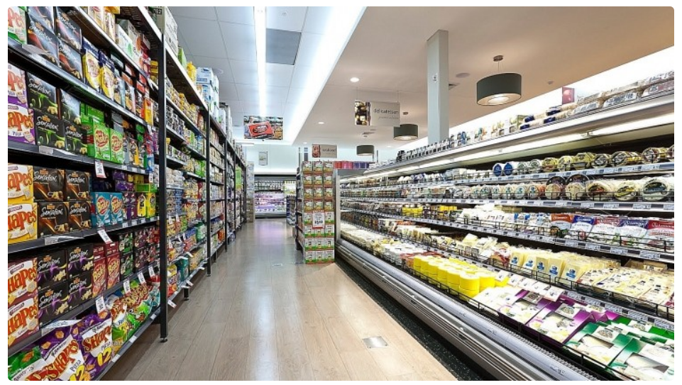
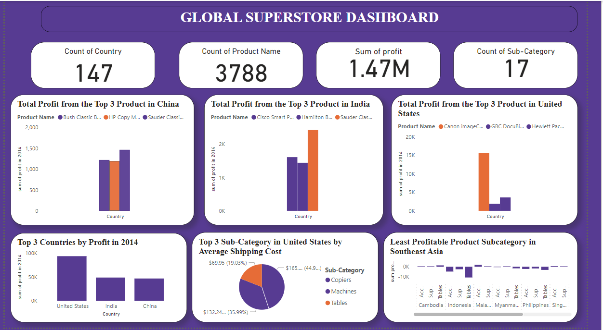
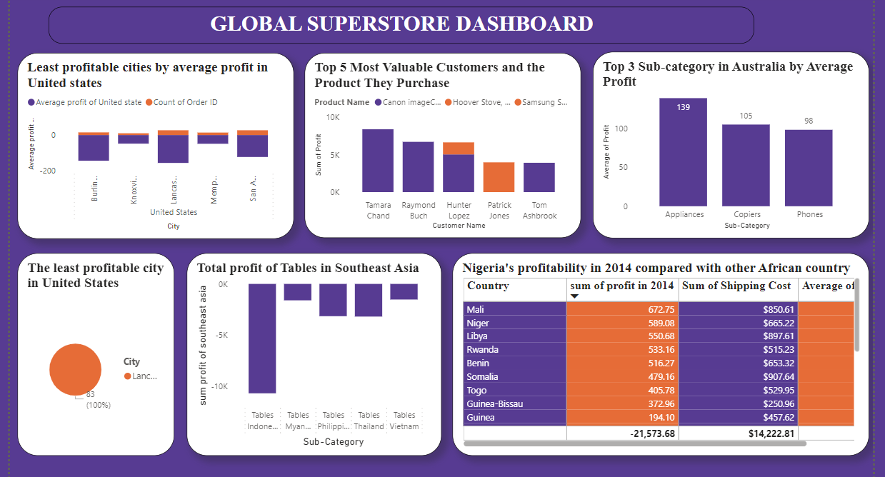
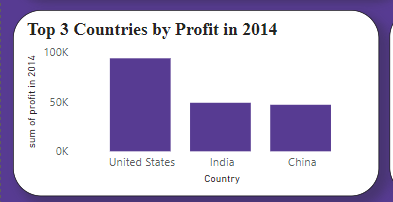

# GLOBAL SUPERSTORES

## Introduction

This is a **global superstore** dataset analyze and visualize with Power Bi.The dataset contains information on sales,profits,products,customers,regions and many other details.The report aims to analyze important aspect of the dataset so as to draw meaniful insight,which will be used to improve sales performance and profitability. 

## Data Source
This data was given as a project from my intensive online data training class by **Digitaley drive**

## Problem Statement
1.Identify the three countries with the highest total profit in 2014 and the top 3 most profitable products in these countries.

2.Identify the top 3 subcategories with the highest average shipping cost in United States.

3.Compare Nigeria's profitability in 2014 with other African countries and analyze the factors for it's poor perfomance looking at shipping cost and average discount rate as  factors.

4.Identify the least profitable product subcategory in Southeast Asia and which specific country should this product be discontinued.

5.Identify the cities with more than or equal to ten orders which is the least profitable by average profit in United States and why is this city's average profit so low.

6.Which product subcategory has the highest average profit in Australia.

7.Identify the most valuable customers and what do they purchase.

## Data Cleaning and Transformation
The dataset was imported into power bi as a csv file, it contain three tables which are Order,People,Return. I upload the dataset into power query editor to changed all null values under profit column to zero so as to get an accurate total result.I also used first column as header rows in people and return table all this resulted to a clean and transformed data ready for visualization and analysis.

## Skill Demonstrated
- Dax,
- Quick measures,
- Filters,
- Charts,
- Button

  ## Visualization
  ### Overview
  

  

  ## Analysis
- Question 1a. The three countries that generated the highest total profit for global superstore in 2014 are:
  - United States,
  - India
  - China

   
 - Question 1b.The top 3 product with the highest total profit for above countries are:
     - United States:
     1. canon imageCLASS 2200 Advanced Copier
     2. Hewlett Packard LaserJet 3310 Copier
     3. GBC DocuBind TL300 Electric Binding System
     - India:
     1. sauder classic bookcase, traditional
     2. cisco smart phone, with caller id
     3. hamilton beach refrigerator,red
     - China:
      1. sauder classic bookcase, metal
      2. bush classic bookcase, mobile
      3. hp copy machine, color

    
   
- Question 2.This are the three subcategories with the highest average shipping cost in United States:
   1. copiers($165.29)
   2. machines($132.25)
   3. tables($69.95)
 
- Question 3. Nigeria's profitability in 2014 is lower significantly when compared with other African countries though it's shipping cost is on the higher rate but it's average discount rate is higher which reduces the profit margin hence resulting in poor performance. 
